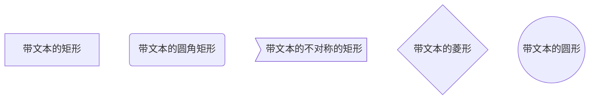

下划虚线-可控制粗细

下划虚线-点状-可控制粗细

下划实线-可控制粗细

红色波浪线

红色虚线

红色实线

    <table style="text-align: center;width:450px">
        <tr>
            <th>column1</th>
            <th>column2</th>
            <th>column3</th>
        </tr>
        <tr>
            <td>value1</td>
            <td>value2</td>
            <td style="word-wrap:break-word;word-break:break-all;">超过宽度自动换行，超过宽度自动换行，超过宽度自动换行，超过宽度自动换行</td>
        </tr>
    </table>

    

		
    

    

        
    

    

        jdk1.8之前
        
    

    

        jdk1.8
        
    

